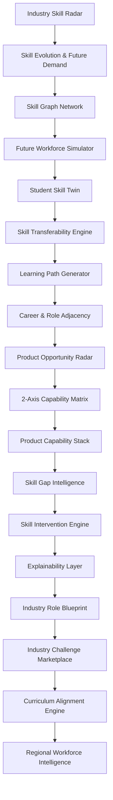

# SkillBridge AI — Workforce & Product Intelligence Platform

> **SIH 2026 Problem Statement**: *"Challenges in aligning skill development programs with industry requirements, product capabilities, and emerging job market demands."*  
> **Data Mode**: **Prototype / Synthetic Intelligence Model** — All regional, workforce, product capability, training capacity, and demand values shown in this prototype represent synthetic intelligence modeling and are not official government or live market census statistics.

---

## 1. Executive Summary & Product Positioning

**SkillBridge AI** is a deterministic workforce and product intelligence platform designed to connect industry demand, emerging capabilities, organization readiness, curriculum supply, and workforce strategic priorities.

Rather than relying on static job descriptions or opaque AI chatbots, SkillBridge treats skills and product opportunities as an interconnected intelligence graph. It connects student learning paths, product capability architecture, organizational strategy, and regional workforce planning into a single, explainable loop across four distinct lenses:
- **Student Lens**: Capability twin, skill gaps, learning roadmaps, and career mobility.
- **Product Lens**: Product Opportunity Radar, 2-axis capability vs. demand matrix, capability stack breakdown, and product readiness.
- **Industry Lens**: Skill evolution radar, future workforce simulation, role blueprints, and employer challenge marketplace.
- **Workforce / Policy Lens**: Regional skill intelligence, state-level workforce pulse, and training supply alignment.

---

## 2. The Core Problem Statement

Traditional workforce development and product strategy suffer from structural disconnects:
1. **Velocity Mismatch**: Industry skill requirements change faster than institutional curriculum update cycles.
2. **Product-Capability Misalignment**: Organizations attempt ambitious product initiatives without visibility into underlying capability bottlenecks.
3. **Emerging Skill Blindness**: Early signals of emerging capabilities are lost in aggregate job market noise.
4. **Opaque Student Gap Analysis**: Students lack actionable clarity on why their existing skills fail to qualify them for target roles.
5. **Unaligned Training Supply**: Training providers lack data-driven visibility into whether their programs prepare learners for future demand.
6. **Geographic Capability Imbalance**: Regional decision-makers lack early warning indicators for emerging workforce shortages.

---

## 3. Implemented Intelligence Architecture

SkillBridge AI operates as a unified multi-engine intelligence platform:



---

## 4. Key Platform Lenses & Engines

### A. Product Intelligence Lens (`/product`)
- **Product Opportunity Radar (Task 39 Redesign)**: Restrained analytical 2-axis matrix mapping **Opportunity Demand** (0–100) against **Capability Readiness** (0%–100%).
  - **4 Strategic Zones**: `BUILD / INVEST` (High Demand / Low Readiness), `PRODUCT READY` (High Demand / High Readiness), `EXPLORE` (Low Demand / Low Readiness), and `OPTIMIZE` (Low Demand / High Readiness).
  - **Summary Strip**: Dynamic metric totals (`OPPORTUNITIES`, `CAPABILITY-CONSTRAINED`, `PRODUCT-READY`, `PRIORITY GAPS`).
  - **Decision-Oriented Detail Panel**: Displays opportunity title, zone badge, demand score, readiness %, capability gap pts, bottleneck constraints, required capability modules, and recommended action directives.
  - **Responsive Matrix**: 2x2 grid for Desktop/Tablet with keyboard accessibility, and structured quadrant-grouped list for Mobile viewports.
- **Product Capability Stack**: Deconstructs product initiatives into multi-tier architectural capability modules and supporting skill gates.

### B. Student Intelligence Lens (`/student`, `/profile/[username]`)
- **Student Skill Twin**: Normalized capability profile (0–100) across technical and domain clusters.
- **Skill Gap & Intervention Engine**: Categorizes gaps (`CRITICAL_BLOCKER`, `QUICK_WIN`) and generates targeted interventions.
- **Learning Path Generator**: Multi-phase roadmaps prioritizing high-leverage unlock skills.
- **Skill Missions & Challenges**: Actionable learning missions and real-world employer challenge verification.

### C. Industry Intelligence Lens (`/company-dashboard`, `/explore`)
- **Industry Skill Radar**: Tracks skill demand trajectories, growth rates, and emerging evolution signals.
- **Future Workforce Simulator**: Projects capability gaps under economic scenarios (e.g. *GenAI Acceleration*, *Cloud Migration Spike*).
- **Role Blueprints**: Comprehensive capability models mapping foundation, core, and advanced thresholds.

### D. Workforce & Policy Intelligence Lens (`/regional-intelligence`)
- **Regional Skill Intelligence**: Models regional talent capability, shortage rankings, and training supply coverage.
- **State Workforce Pulse**: High-level regional intelligence, district cluster profiles, and executive decision actions.

---

## 5. Active User-Facing Route Inventory

| Route | Purpose | Target User / Context | Status |
| :--- | :--- | :--- | :--- |
| `/` | Public landing page & lens gateway | General / Public | Implemented |
| `/get-started` | Onboarding & role-based entry flow | New / Returning Users | Implemented |
| `/login` | Authentication Sign In | Authenticated Users | Implemented |
| `/register` | Account Sign Up | New Users | Implemented |
| `/student` | Student Application Portal & Skill Twin | Students | Implemented |
| `/student/[tab]` | Student Tabbed Navigation (Roadmap, Gaps, Missions) | Students | Implemented |
| `/product` | Product Intelligence & Opportunity Radar | Product Leaders / Strategists | Implemented (Task 39 Redesign) |
| `/company-dashboard` | Workforce simulation & scenario planning | Industry Leaders | Implemented |
| `/explore` | Industry Skill Radar & discovery | Students / Industry | Implemented |
| `/explore/[id]` | Skill detail view & network links | Students / Educators | Implemented |
| `/skill-graph` | Interactive Skill Relationship Graph | Students / Researchers | Implemented |
| `/profile/[username]` | Student Skill Twin, readiness & challenges | Students / Recruiters | Implemented |
| `/challenges` | Industry Challenge Marketplace | Students / Industry | Implemented |
| `/challenges/[id]` | Challenge detail & evidence submission | Students | Implemented |
| `/training` | Curriculum Alignment Marketplace | Educators / Students | Implemented |
| `/training/[id]` | Curriculum Alignment Matrix Detail | Curriculum Designers | Implemented |
| `/regional-intelligence` | Regional Skill Intelligence Exchange | Workforce Planners | Implemented |
| `/regional-intelligence/[id]`| Regional Profile & Shortages | Policy Makers | Implemented |

---

## 6. Deterministic Intelligence Methodology

All scoring algorithms in SkillBridge AI are **100% pure and deterministic**. The platform does **not** rely on non-deterministic LLM API calls for core analytics.

### Core Formulas:
- **Capability Gap**: $\text{Demand Score} - \text{Readiness Score}$
- **Industry Readiness**: $(\text{Acquired Proficiency} / \text{Required Level}) \times \text{Skill Weight}$
- **Curriculum Alignment**: $(\text{Coverage} \times 0.30) + (\text{Depth} \times 0.20) + (\text{Practical} \times 0.15) + (\text{Current Demand} \times 0.15) + (\text{Future Demand} \times 0.15) + (\text{Role Coverage} \times 0.05) - \text{Staleness Penalty}$
- **Regional Alignment**: $(\text{Demand Coverage} \times 0.30) + (\text{Future Coverage} \times 0.20) + (\text{Capability} \times 0.20) + (\text{Training Supply} \times 0.15) + (\text{Curriculum Align} \times 0.10) + (\text{Mobility} \times 0.05)$

---

## 7. Technology Stack

- **Framework**: Next.js 16 (App Router / Turbopack)
- **UI & Logic**: React 19, JavaScript (ES6+), Tailwind CSS
- **Icons**: Lucide React
- **Authentication & State**: Role-based session management (`userSession.js`), persistent localStorage sync
- **Build System**: Next.js Turbopack compiler (`npm run build`)

---

## 8. Getting Started

### Prerequisites
- **Node.js**: v18.0.0 or higher
- **npm**: v9.0.0 or higher

### Installation & Local Development

```bash
# 1. Clone repository & install dependencies
npm install

# 2. Run local development server
npm run dev

# 3. Access local application
# Open http://localhost:3000 in your browser
```

### Build & Verification Commands

```bash
# Run ESLint validation
npm run lint

# Run Next.js production build
npm run build
```

---

## 9. Feature Implementation History

- [x] Industry Skill Radar & Skill Evolution (`Task 10`)
- [x] Industry Skill Graph (`Task 11`)
- [x] Future Workforce Simulator (`Task 12`)
- [x] Skill Transferability Engine (`Task 13`)
- [x] Learning Path Generator (`Task 14`)
- [x] Career / Role Adjacency Engine (`Task 15`)
- [x] Student Skill Twin (`Task 16`)
- [x] Industry Readiness Engine (`Task 17`)
- [x] Skill Gap Intelligence (`Task 18`)
- [x] Skill Intervention Engine (`Task 19`)
- [x] Explainability Layer (`Task 21`)
- [x] Skill Missions Engine (`Task 22`)
- [x] Industry Role Blueprint (`Task 23`)
- [x] Industry Challenge Marketplace (`Task 24`)
- [x] Training / Curriculum Alignment (`Task 25`)
- [x] Regional Skill Intelligence (`Task 26`)
- [x] Maharashtra Workforce Intelligence Dashboard (`Task 27`)
- [x] Product / Industry Lens Separation (`Task 33B`)
- [x] Authentication & Entry Flow Redesign (`Task 34 & 35`)
- [x] Role-Based Application Shell & Navigation (`Task 36, 37, 38`)
- [x] Product Opportunity Radar Visual Redesign (`Task 39`)
